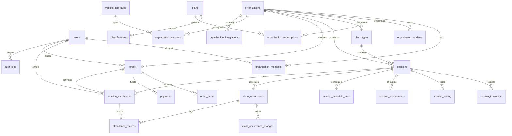

# ProgressRooms Entity-Relationship Diagram

```mermaid
erDiagram
    users ||--o{ organization_members : "belongs to"
    users ||--o{ session_enrollments : "enrolls"
    users ||--o{ orders : "places"
    users ||--o{ audit_logs : "triggers"

    organizations ||--o{ organization_members : "has"
    organizations ||--o{ organization_students : "tracks"
    organizations ||--o{ organization_subscriptions : "subscribes"
    organizations ||--o{ class_types : "categorizes"
    organizations ||--o{ sessions : "conducts"
    organizations ||--o{ orders : "receives"
    organizations ||--o{ organization_websites : "configures"
    organizations ||--o{ organization_integrations : "connects"

    plans ||--o{ plan_features : "defines"
    plans ||--o{ organization_subscriptions : "governs"

    class_types ||--o{ sessions : "contains"
    sessions ||--o{ session_instructors : "assigns"
    sessions ||--o{ session_pricing : "prices"
    sessions ||--o{ session_requirements : "stipulates"
    sessions ||--o{ session_schedule_rules : "schedules"
    sessions ||--o{ class_occurrences : "generates"
    sessions ||--o{ session_enrollments : "has"

    class_occurrences ||--o{ class_occurrence_changes : "tracks"
    class_occurrences ||--o{ attendance_records : "logs"

    session_enrollments ||--o{ attendance_records : "records"

    orders ||--o{ order_items : "contains"
    orders ||--o{ payments : "fulfills"
    orders ||--o{ session_enrollments : "activates"

    website_templates ||--o{ organization_websites : "styles"
```
